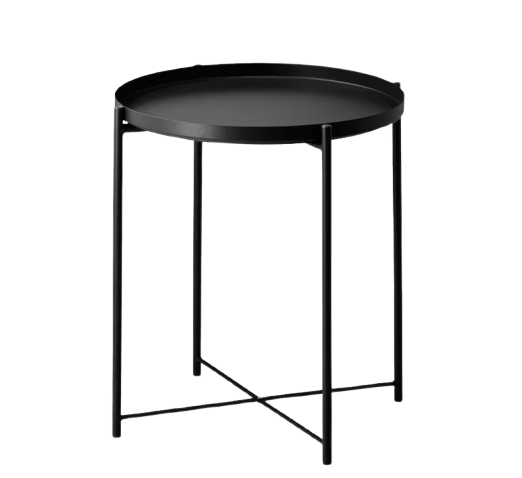
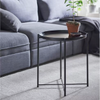

        <!-- Left Column: Product Images -->
        

          <!-- Main Product Image Slider -->
          

            <!-- "NEW" Badge -->
            

              NEW
            

            <!-- Sale Badge -->
            

              -50%
            

            <!-- Main Image Swiper -->
            

              

                

                  
                

                

                  
                

                

                  
                

              

              <!-- Navigation Arrows -->
              

                <svg xmlns="http://www.w3.org/2000/svg" class="h-5 w-5" fill="none" viewBox="0 0 24 24" stroke="currentColor">
                  <path stroke-linecap="round" stroke-linejoin="round" stroke-width="2" d="M15 19l-7-7 7-7" />
                </svg>
              

              

                <svg xmlns="http://www.w3.org/2000/svg" class="h-5 w-5" fill="none" viewBox="0 0 24 24" stroke="currentColor">
                  <path stroke-linecap="round" stroke-linejoin="round" stroke-width="2" d="M9 5l7 7-7 7" />
                </svg>
              

            

          

          <!-- Thumbnails -->
          

            

              

                
              

              

                
              

              

                
              

            

          

        

        <!-- Right Column: Product Details -->
        

          <!-- Rating -->
          

            

              <!-- Star Icons here (as in your original code) -->
            

            11 Reviews
          

          
          <!-- Product Title -->
          <h1 class="text-4xl font-bold mb-4">Tray Table</h1>
          
          <!-- Product Description -->
          

            Buy one or buy a few and make every space where you sit more convenient. Light and easy to move around with removable tray top, handy for serving snacks.
          

          
          <!-- Price -->
          

            $199.00
            $400.00
          

          
          <!-- Countdown Timer -->
          

            
Offer expires in:

            

              

                
02

                Days
              

              

                
12

                Hours
              

              

                
45

                Minutes
              

              

                
05

                Seconds
              

            

          

    
          <!-- Measurements -->
          

            <h3 class="text-lg mb-2">Measurements</h3>
            
17 1/2×20 5/8 "

          

          
          <!-- Color Selection -->
          

            

              <h3 class="text-lg">Choose Color</h3>
            

            
Black

            

              <!-- Color selection boxes (as in your original code) -->
            

          

    
          <!-- Quantity -->
          

            

              <button class="px-4 py-2 text-lg">−</button>
              <input type="text" value="1" class="w-10 text-center py-2" />
              <button class="px-4 py-2 text-lg">+</button>
            

            <button class="border border-gray-300 rounded-md px-4 py-2 flex items-center gap-2">
              <svg xmlns="http://www.w3.org/2000/svg" class="h-5 w-5" fill="none" viewBox="0 0 24 24" stroke="currentColor">
                <path stroke-linecap="round" stroke-linejoin="round" stroke-width="2" d="M4.318 6.318a4.5 4.5 0 000 6.364L12 20.364l7.682-7.682a4.5 4.5 0 00-6.364-6.364L12 7.636l-1.318-1.318a4.5 4.5 0 00-6.364 0z" />
              </svg>
              Wishlist
            </button>
          

          <!-- Add to Cart Button -->
          <button class="w-full bg-black text-white font-medium py-3 mb-6">
            Add to Cart
          </button>
          
          <!-- Product Info -->
          

            

              SKU
              1117
            

            

              CATEGORY
              Living Room, Bedroom
            

          

        

      

      <!-- js code  -->
      document.addEventListener("DOMContentLoaded", function () {
  // Initialize thumbnail swiper
  var productThumbsSwiper = new Swiper(".product-thumbs-swiper", {
      spaceBetween: 10,
      slidesPerView: 3,
      freeMode: true,
      watchSlidesProgress: true,
  });

  // Initialize main swiper with thumbs
  var productMainSwiper = new Swiper(".product-main-swiper", {
      spaceBetween: 10,
      navigation: {
          nextEl: ".swiper-button-next",
          prevEl: ".swiper-button-prev",
      },
      thumbs: {
          swiper: productThumbsSwiper,
      },
  });
});
  
    // // Countdown timer functionality
    // function updateCountdown() {
    //   // Set target date (example: 2 days, 12 hours, 45 minutes, 5 seconds from now)
    //   const targetDate = new Date();
    //   targetDate.setDate(targetDate.getDate() + 2); // 2 days from now
    //   targetDate.setHours(targetDate.getHours() + 12); // 12 more hours
    //   targetDate.setMinutes(targetDate.getMinutes() + 45); // 45 more minutes
    //   targetDate.setSeconds(targetDate.getSeconds() + 5); // 5 more seconds
  
    //   const now = new Date();
    //   const difference = targetDate - now;
  
    //   const days = Math.floor(difference / (1000 * 60 * 60 * 24));
    //   const hours = Math.floor((difference % (1000 * 60 * 60 * 24)) / (1000 * 60 * 60));
    //   const minutes = Math.floor((difference % (1000 * 60 * 60)) / (1000 * 60));
    //   const seconds = Math.floor((difference % (1000 * 60)) / 1000);
  
    //   // Update countdown elements
    //   document.querySelector('.countdown-days').textContent = days.toString().padStart(2, '0');
    //   document.querySelector('.countdown-hours').textContent = hours.toString().padStart(2, '0');
    //   document.querySelector('.countdown-minutes').textContent = minutes.toString().padStart(2, '0');
    //   document.querySelector('.countdown-seconds').textContent = seconds.toString().padStart(2, '0');
    // }
  
    // // Initial call and then update every second
    // updateCountdown();
    // setInterval(updateCountdown, 1000);

  

